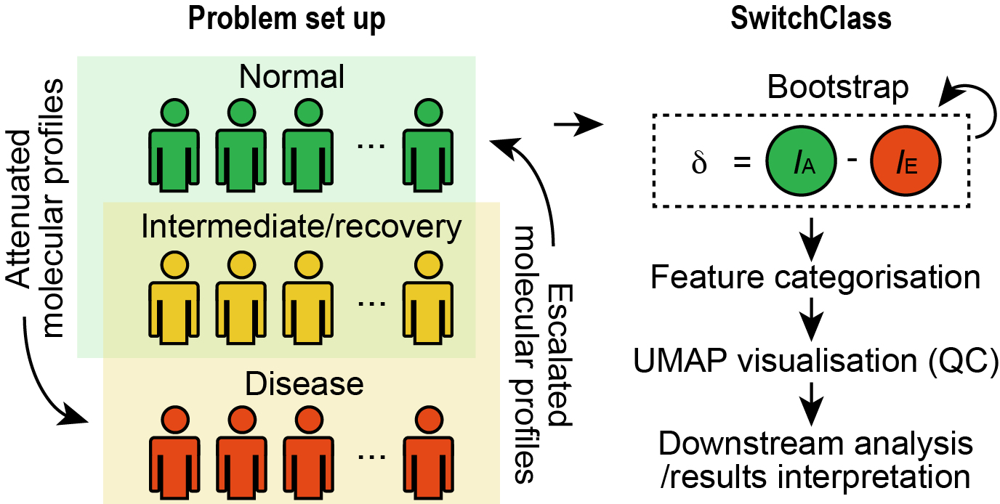

# SwitchClass

`SwitchClass` is a R package for quantifying and visualizing *molecular reversibility and persistence* across biological perturbations using a label-switch classification framework.  
It provides a unified workflow for identifying *attenuated* versus *escalated* molecular features in longitudinal or comparative omics datasets.

The package was developed as part of the study **Dissecting Reversal and Persistence of Molecular Features via a Label-Switch Classification Framework**, which systematically maps molecular trajectories that normalize or remain dysregulated under different biological or therapeutic conditions.

---

## Overview



`SwitchClass` implements the following core components:

1. **Label-switch classification**  
   A random-forest–based approach that compares importance profiles between two inverted label schemes to compute a per-feature *delta score* (\(\delta = I_{rev} - I_{per}\)) indicating reversal versus persistence.

2. **Visualization utilities**  
   Functions for visualizing molecular states via UMAP embeddings, quadrant-based scatterplots, feature-level boxplots, and annotated heatmaps.

3. **Downstream interpretation**  
   Tools for pathway enrichment (Reactome) and quadrant-based biological annotation.

4. **Example datasets and vignettes**  
   Includes demonstration data from colorectal cancer (CRC), phosphoproteomic, and immune-transcriptomic studies.

---

## Installation

Install the development version from GitHub:

```r
# install dependencies if not already installed
# BiocManager::install("PhosR")
# BiocManager::install("reactome.db")
# BiocManager::install("org.Hs.eg.db")
# BiocManager::install("annotate")

devtools::install_github("PYangLab/SwitchClass",
                         build_vignettes = TRUE,
                         dependencies = TRUE)

```

## Vignette 

Please find our vignette: 
```r
browseVignettes("SwitchClass")
```

## Contact us

If you have any enquiries about SwitchClass, please contact di.xiao@sydney.edu.au. We are also happy to receive any suggestions and comments.

